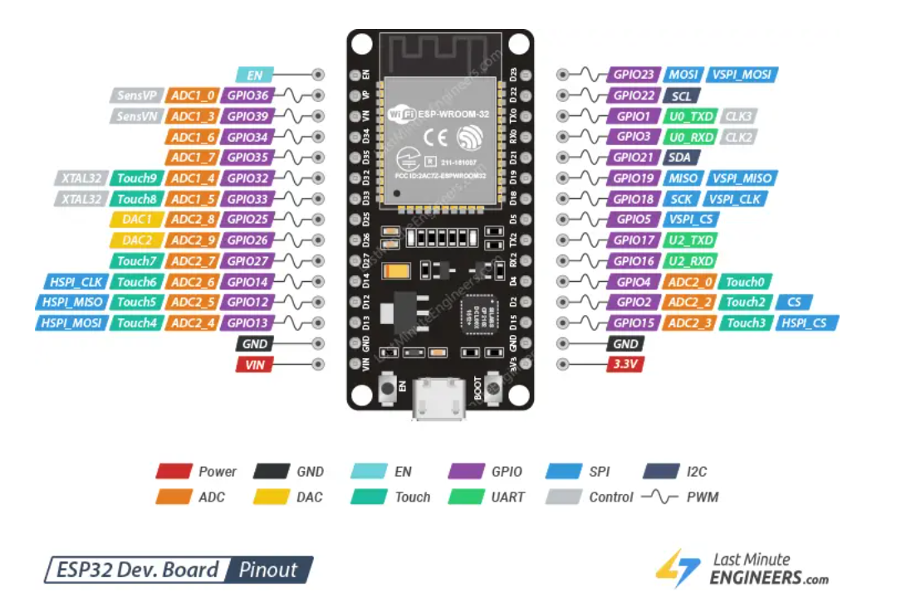

# Microstation

This repo contains the code related to my journey with developing things with Arduino, ESP32 and [MicroPython](https://micropython.org/). Each folder at the root level besides `img` will contain code related to each of the boards used.

# Installation

## Micropython
You can find installations [here](https://micropython.org/download/), but,  for Manjaro, I had to compile the source code using pamac: `pamac build micropython-git`

## ESP32
For the ESP32, I followed [this guide](https://micropython.org/download/ESP32_GENERIC/). But basically:

1. Install `esptool`: `pip install esptool`
2. Flash board memory: `esptool erase-flash` or `esptool --port PORTNAME erase-flash`
   _PORTNAME_ example: `/dev/ttyUSB0`
3. Download the firmware for your board, mine was [this one](https://micropython.org/download/ESP32_GENERIC/).
4. Deploy the firmware to the board: `esptool --baud 460800 write-flash 0x1000 ESP32_BOARD_NAME-DATE-VERSION.bin`
where _ESP32_BOARD_NAME-DATE-VERSION.bin_  is the name of the file you just downloaded.

### Diagram

I am using a 30-pin ESP32 WROOM board, and I found the diagram [here](https://lastminuteengineers.com/esp32-pinout-reference/).
## Arduino
For Arduino, I did some stuff using the Arduino IDE, but I coded in C over there.

# Cool Tutorials

- [Tutorial] RGB LED using micropython: https://www.donskytech.com/control-rgb-led-using-micropython/
